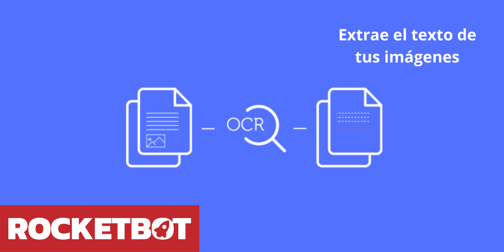

# OCR Offline Tesseract
  
Module to extract text from an image  

*Read this in other languages: [English](Manual_OCR_Tesseract.md), [Português](Manual_OCR_Tesseract.pr.md), [Español](Manual_OCR_Tesseract.es.md)*
  

## How to install this module
  
To install the module in Rocketbot Studio, it can be done in two ways:
1. Manual: __Download__ the .zip file and unzip it in the modules folder. The folder name must be the same as the module and inside it must have the following files and folders: \__init__.py, package.json, docs, example and libs. If you have the application open, refresh your browser to be able to use the new module.
2. Automatic: When entering Rocketbot Studio on the right margin you will find the **Addons** section, select **Install Mods**, search for the desired module and press install.  

## Page segmentation modes (psm)
  0    Orientation and script detection (OSD) only.
  1    Automatic page segmentation with OSD.
  2    Automatic page segmentation, but no OSD, or OCR. (not implemented)
  3    Fully automatic page segmentation, but no OSD. (Default)
  4    Assume a single column of text of variable sizes.
  5    Assume a single uniform block of vertically aligned text.
  6    Assume a single uniform block of text.
  7    Treat the image as a single text line.
  8    Treat the image as a single word.
  9    Treat the image as a single word in a circle.
  10    Treat the image as a single character.
  11    Sparse text. Find as much text as possible in no particular order.
  12    Sparse text with OSD.
  13    Raw line. Treat the image as a single text line,
        bypassing hacks that are Tesseract-specific.

## Description of the commands

### Convert image to text
  
Convert an image to text
|Parameters|Description|example|
| --- | --- | --- |
|Image ||Imagen.jpg|
|Page segmentation modes (psm)||3|
|Assign result to variable||Variable|

### Get character boxes
  
Get character boxes from an image
|Parameters|Description|example|
| --- | --- | --- |
|Image ||Imagen.jpg|
|Assign result to variable||Variable|
