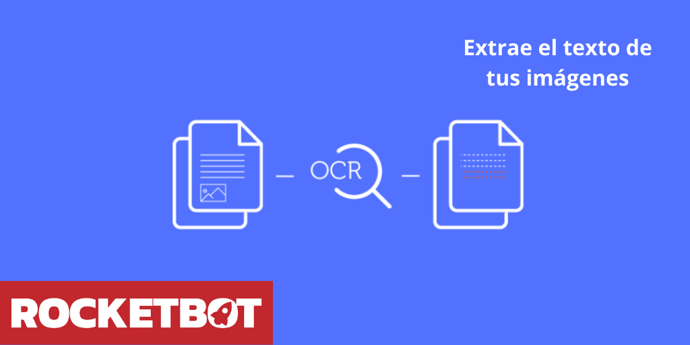

# OCR Offline Tesseract
  
Módulo para extrair texto de uma imagem  

*Read this in other languages: [English](Manual_OCR_Tesseract.md), [Português](Manual_OCR_Tesseract.pr.md), [Español](Manual_OCR_Tesseract.es.md)*
  

## Como instalar este módulo
  
Para instalar o módulo no Rocketbot Studio, pode ser feito de duas formas:
1. Manual: __Baixe__ o arquivo .zip e descompacte-o na pasta módulos. O nome da pasta deve ser o mesmo do módulo e dentro dela devem ter os seguintes arquivos e pastas: \__init__.py, package.json, docs, example e libs. Se você tiver o aplicativo aberto, atualize seu navegador para poder usar o novo módulo.
2. Automático: Ao entrar no Rocketbot Studio na margem direita você encontrará a seção **Addons**, selecione **Install Mods**, procure o módulo desejado e aperte instalar.  

## Segmentation page modes (psm)
  0    Orientation and script detection (OSD) only.
  1    Automatic page segmentation with OSD.
  2    Automatic page segmentation, but no OSD, or OCR. (not implemented)
  3    Fully automatic page segmentation, but no OSD. (Default)
  4    Assume a single column of text of variable sizes.
  5    Assume a single uniform block of vertically aligned text.
  6    Assume a single uniform block of text.
  7    Treat the image as a single text line.
  8    Treat the image as a single word.
  9    Treat the image as a single word in a circle.
  10    Treat the image as a single character.
  11    Sparse text. Find as much text as possible in no particular order.
  12    Sparse text with OSD.
  13    Raw line. Treat the image as a single text line,
        bypassing hacks that are Tesseract-specific.

## Descrição do comando

### Converter imagem em texto
  
Converter uma imagem em texto
|Parâmetros|Descrição|exemplo|
| --- | --- | --- |
|Imagem ||Imagem.jpg|
|Modos de segmentação de página (psm)||3|
|Atribuir resultado à variável||Variável|

### Obter caixas de caracteres
  
Obter caixas de caracteres de uma imagem
|Parâmetros|Descrição|exemplo|
| --- | --- | --- |
|Imagem ||Imagem.jpg|
|Atribuir resultado à variável||Variável|
